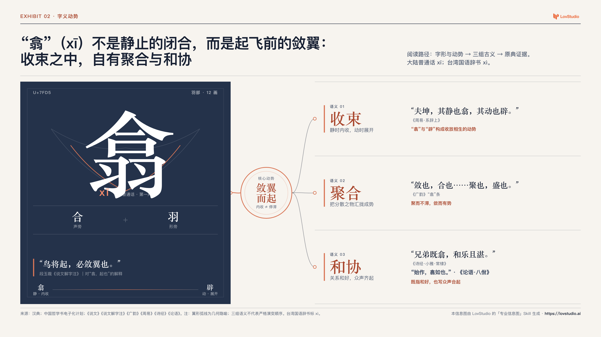

# sgc-hanzi-lens


把一个汉字做成有来源、有边界、看得懂也记得住的专业视觉解释。

Part of [lovstudio skills](https://github.com/lovstudio/skills) — by [lovstudio.ai](https://lovstudio.ai)

## 它解决什么问题

普通汉字卡片常把拼音、部首和几条释义并排摆放，却没有解释这些信息之间的关系；更糟的是，会把现代拆字口诀当字源，把视觉想象当古文字形。

Hanzi Lens 从证据关系开始：

```text
一个汉字
   ↓
Unicode 与字体覆盖
   ↓
现代标准 + 历史字书 + 经典语境
   ↓
事实 / 注释 / 解释 / 隐喻分层
   ↓
单一语义主线
   ↓
专业信息图 + 双重严格审计
```

默认只解释字本身，不延伸到具体人物、性格、命理或关系推断。

## 标杆案例：「翕」

“翕”不是静止的闭合，而是起飞前的敛翼：收束之中，自有聚合与和协。



案例包含完整研究台账、可编辑 HTML、高清 PNG、字体报告与严格审计：

[`examples/xi/`](examples/xi/)

## 能力

- 校验单个汉字及 Unicode / IVS 身份；
- 用真实字体文件检查目标字形覆盖；
- 区分大陆普通话、台湾国语及其他地区读音；
- 区分现代字典事实、历史字书、注家解释和当代综合；
- 为古义、经典引文和视觉标记建立来源映射；
- 根据语义关系选择驱动树、比较矩阵等 Exhibit 模板；
- 调用 `sgc-professional-infographic` 生成可编辑 HTML/SVG 与高清 PNG；
- 同时执行汉字领域审计和专业信息图审计；
- 在全尺寸与缩略图下完成人工视觉复核。

## 安装

先安装专业信息图依赖：

```bash
git clone https://github.com/lovstudio/professional-infographic-skill \
  "${LOVSTUDIO_SKILLS_INSTALL_DIR:-$HOME/.agents/skills}/sgc-professional-infographic"
```

再安装 Hanzi Lens：

```bash
git clone https://github.com/lovstudio/hanzi-lens-skill \
  "${LOVSTUDIO_SKILLS_INSTALL_DIR:-$HOME/.agents/skills}/sgc-hanzi-lens"
```

Python 依赖：

```bash
python3 -m pip install "fonttools>=4.53,<5" "playwright>=1.45,<2"
python3 -m playwright install chromium
```

## 使用

在支持 Agent Skills 的助手中直接说：

```text
解释一下「翕」
这个字什么意思：曌
一图讲清楚「龘」
做一张汉字字源信息图
Explain this Chinese character: 翕
Create a Chinese character infographic for 曌
```

也可以直接使用 CLI：

```bash
SKILL_DIR="${LOVSTUDIO_SKILLS_INSTALL_DIR:-$HOME/.agents/skills}/sgc-hanzi-lens"

python3 "$SKILL_DIR/scripts/hanzi_lens.py" inspect "翕"

python3 "$SKILL_DIR/scripts/hanzi_lens.py" scaffold "翕" \
  --locale both \
  --output-dir ./hanzi-xi

python3 "$SKILL_DIR/scripts/hanzi_lens.py" font-check "翕" \
  --portable \
  --output ./hanzi-xi/font-report.json
```

完成 `research.json`、`source.md` 和 `brief.md` 后：

```bash
python3 "$SKILL_DIR/scripts/hanzi_lens.py" exhibit \
  --project ./hanzi-xi \
  --title "“翕”不是静止的闭合，而是起飞前的敛翼" \
  --template driver-tree

python3 "$SKILL_DIR/scripts/hanzi_lens.py" render \
  --project ./hanzi-xi \
  --scale 2

python3 "$SKILL_DIR/scripts/hanzi_lens.py" audit \
  --project ./hanzi-xi \
  --human-review passed \
  --review-note "已检查原图与缩略图；字形、语义关系、来源和边界清晰。" \
  --strict
```

## CLI

| 子命令 | 作用 |
|---|---|
| `inspect` | 校验一个汉字并输出 Unicode 元数据 |
| `scaffold` | 创建非覆盖式研究项目 |
| `font-check` | 检查真实字体文件是否覆盖该字 |
| `exhibit` | 调用专业信息图依赖创建 Exhibit 骨架 |
| `render` | 渲染高清 PNG |
| `audit` | 执行领域审计与专业信息图审计 |

## 产物

```text
hanzi-project/
├── project.json
├── hanzi.json
├── research.json
├── source.md
├── brief.md
├── font-report.json
├── hanzi-audit.json
└── exhibit/
    ├── poster.html
    ├── poster.png
    ├── source.md
    ├── brief.md
    ├── project.json
    └── audit.json
```

## 配置

解析顺序：

1. CLI 参数；
2. `LOVSTUDIO_HANZI_LENS_*` 环境变量；
3. `LOVSTUDIO_SKILLS_*` 环境变量；
4. `${LOVSTUDIO_SKILLS_PROFILE:-$HOME/.lovstudio/skills/profile.json}`；
5. `$HOME/Documents` 下的安全默认目录。

详见 [`references/user-config.md`](references/user-config.md)。

## 研究底线

- 不从现代字形外观直接推断古代造字意图；
- 不把《说文》原文与后世注家的解释混写；
- 不把不同地区的读音折叠成一个“唯一正确”答案；
- 不把检索摘要当完整语境；
- 不伪造甲骨文、金文、篆书或名家书法；
- 不用没有来源的“稀有度”“吉祥度”“人格分”；
- 视觉隐喻必须明确标作隐喻。

## License

MIT
