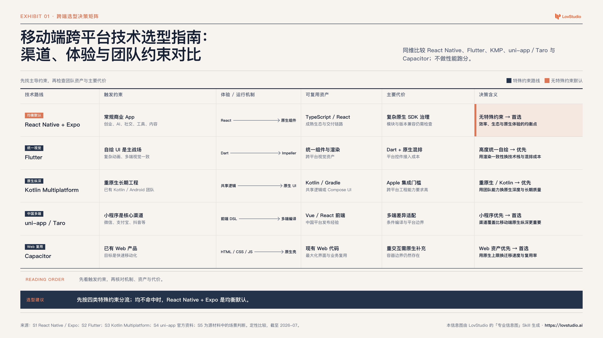
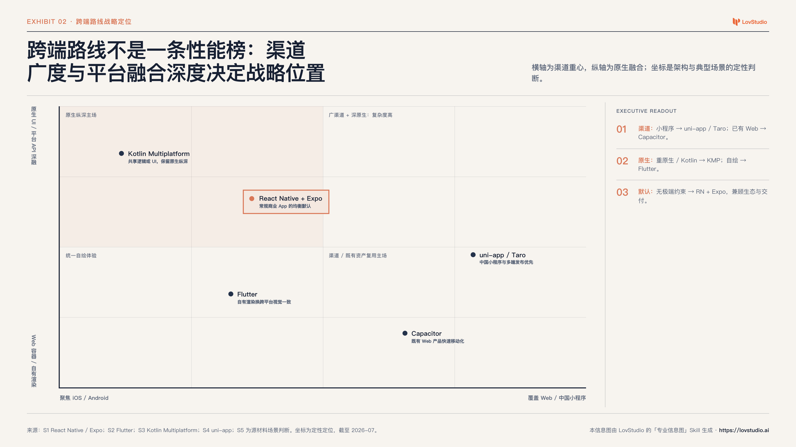

# lov-professional-infographic


把当前上下文、研究结论或文档，转成咨询 Exhibit：先建立可辩护的视觉论证，再生成可编辑 HTML/SVG 与高清 PNG。

Part of [lovstudio skills](https://github.com/lovstudio/skills) — by [lovstudio.ai](https://lovstudio.ai)

## 它解决什么问题

普通信息图生成器往往从“挑一个风格”开始，结果是装饰很多、结论很弱。本 Skill
先区分标题与建议的产品角色，再建立可辩护的视觉论证：

```text
原始上下文
    ↓
事实与证据审计
    ↓
决策与证据图
    ↓
主题标题 / 行动标题 + 语义 Exhibit 模板
    ↓
直接标注的可编辑 Exhibit
    ↓
尾部建议（主题模式）
    ↓
机器门禁 + 原图与缩略图人工复核
```

默认路线是 HTML/CSS/SVG 代码渲染。图像模型只用于必要的无文字插图，所有标题、数字、图表、Logo 与来源均由代码排版。

### 同一材料，两种不同决策视角

**决策矩阵：先按特殊约束分流，再选择均衡默认**



**定位图：用渠道广度与平台融合深度解释战略位置**



## 质量标准

- 默认采用“主题模式”：顶部说明图的主题、用途或比较任务，建议放在主视觉之后；
- 已有明确上下文的管理层 Exhibit 可采用“行动模式”：顶部直接给结论，并省略重复建议；
- 主视觉必须支持最终建议或行动标题，而不是把文字改写成三张卡片；
- 建议必须位于证据之后、来源之前，并映射到证据 ID；
- 数字、坐标、分支、因果箭头和决策单元必须映射到证据；
- 图形由信息关系决定，并满足模板专用语义契约；
- 定量图必须有单位、口径、周期与共享尺度；
- 颜色、位置、长度、形状、连接、顺序和包含关系只用于编码明确含义；
- 直接标注决策变化点，控制说明文字，拒绝空容器和伪图表；
- 无溢出、无占位文本、无 emoji、无“AI 渐变 + 随机装饰”；
- 右上角或右下角品牌 Logo；
- 明确标注由“专业信息图”Skill 生成；
- 交付 PNG、可编辑 HTML、原始来源、证据 brief 和审计报告；
- 机器代理分达到 85/100、关键维度达标，并完成人工原图复核。

## 八种语义模板

| 信息关系 | 模板 |
|---|---|
| 备选方案 × 一致标准 | `comparison-matrix` |
| 连续约束与分支结果 | `decision-tree` |
| 结果 → 驱动因素 → 子因素 | `driver-tree` |
| 两个独立维度上的位置 | `positioning-map` |
| 起点 + 增益 − 损失 = 终点 | `waterfall` |
| 阶段、里程碑、Gate 与依赖 | `roadmap` |
| 参与者、能力、流与结果 | `operating-model` |
| 同尺度重复比较 | `small-multiples` |

## 安装

```bash
git clone https://github.com/lovstudio/professional-infographic-skill \
  "${LOVSTUDIO_SKILLS_INSTALL_DIR:-$HOME/.agents/skills}/lov-professional-infographic"
```

渲染 PNG 和执行浏览器审计需要：

```bash
python3 -m pip install "playwright>=1.45,<2"
python3 -m playwright install chromium
```

如本机已安装 Google Chrome，CLI 会在 Playwright 自带 Chromium 不可用时尝试回退。

## 使用

在支持 Agent Skills 的助手中直接说：

```text
把以上内容做成专业信息图
把这份研究整理成一张咨询风格的一页图
一图总结这个产品方案
Turn this into a professional infographic
Create a consulting-style visual summary
```

也可以直接使用 CLI：

```bash
SKILL_DIR="${LOVSTUDIO_SKILLS_INSTALL_DIR:-$HOME/.agents/skills}/lov-professional-infographic"

python3 "$SKILL_DIR/scripts/infographic_cli.py" scaffold \
  --title "移动端跨平台技术选型指南：渠道、性能与团队约束对比" \
  --title-mode topic \
  --recommendation "先按渠道与原生约束分流；均不命中时，RN + Expo 是均衡默认。" \
  --source report.md \
  --template comparison-matrix \
  --mode qualitative \
  --aspect 16:9 \
  --output-dir ./infographic-output

python3 "$SKILL_DIR/scripts/infographic_cli.py" render \
  --input ./infographic-output/poster.html \
  --output ./infographic-output/poster.png \
  --scale 2

python3 "$SKILL_DIR/scripts/infographic_cli.py" audit \
  --input ./infographic-output/poster.html \
  --image ./infographic-output/poster.png \
  --report ./infographic-output/audit.json \
  --human-review passed \
  --review-note "已检查原图与缩略图；主题、证据与尾部建议层级清晰，编码、来源、单位和注释均可读。" \
  --strict
```

`topic` 是默认标题模式，阅读顺序是“主题 → 证据 → 建议”。如果图表嵌在已有上下文的
管理层报告中，可改用 `--title-mode action`，此时标题直接给出结论，并且不传
`--recommendation`。

## 品牌配置

优先级：

1. CLI `--brand-profile`
2. `LOVSTUDIO_PROFESSIONAL_INFOGRAPHIC_BRAND_PROFILE`
3. `LOVSTUDIO_SKILLS_BRAND_PROFILE`
4. `${LOVSTUDIO_SKILLS_PROFILE:-$HOME/.lovstudio/skills/profile.json}`
5. 仓库自带的 LovStudio 公开品牌默认值

初始化自己的品牌：

```bash
python3 "$SKILL_DIR/scripts/infographic_cli.py" init-brand \
  --name "My Brand" \
  --logo "/absolute/path/to/logo.svg" \
  --primary "#1F2937" \
  --accent "#D97757" \
  --copyright "Generated by My Brand's Professional Infographic Skill"
```

默认写入：

```text
~/.lovstudio/skills/professional-infographic-brand.json
```

完整配置契约见 [`references/user-config.md`](references/user-config.md)。

## 产物

```text
infographic-output/
├── source.md       # 原始输入
├── brief.md        # 决策、结论、编码方案与逐项证据台账
├── poster.html     # 可编辑源文件
├── poster.png      # 高清发布图
├── project.json    # 项目与品牌元数据
├── audit.json      # 自动质量审计
└── assets/
```

## 与常见方案的区别

| 方案 | 优点 | 主要风险 | 本 Skill 的处理 |
|---|---|---|---|
| 整图文生图 | 插画感强、速度快 | 文字、数字、图表不可控 | 只生成无文字辅助插图 |
| 固定模板 | 稳定 | 内容被模板牵着走 | 先定信息关系，再选语义模板 |
| 声明式图表 | 数据结构清晰 | 单个图表不等于完整海报 | 放入结论、证据、品牌和来源的整体层级 |
| 自由代码排版 | 控制力强 | 容易缺少质量门禁 | 语义契约 + 100 分机器代理 + 原图复核 |

## 开源参考

- [AntV Infographic](https://github.com/antvis/Infographic)：声明式信息图与 SVG 渲染底座。
- [awesome-design-md](https://github.com/VoltAgent/awesome-design-md)：品牌设计令牌与 UI 风格档案。
- [baoyu-infographic](https://github.com/JimLiu/baoyu-skills/tree/main/skills/baoyu-infographic)：布局与视觉风格组合工作流。

这些项目提供模板、语法或风格参考，但不能替代咨询 Exhibit 的证据链。本 Skill
重点补上标题模式、证据台账、图形语义、尾部建议、直接标注、决策含义和可验证质量门禁。

## License

MIT
