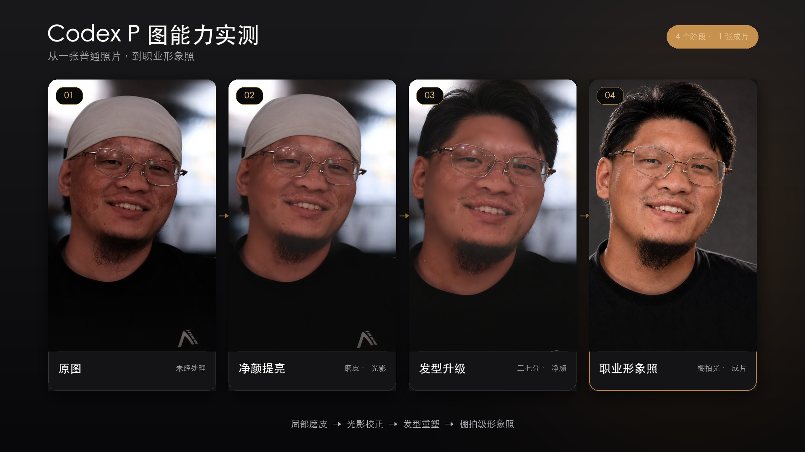

# lov-professional-portrait


把一张普通人像修成干净、自然、仍然像本人的职业形象照。

它把“磨皮、提亮、去帽、补发型、职业化”拆成尽量少的编辑步骤，并用身份一致性、皮肤质感、发际线和光影完整性做最终质检。

Part of [lovstudio skills](https://github.com/lovstudio/skills) — by [lovstudio.ai](https://lovstudio.ai)

## 能做什么

- 自然磨皮、均匀肤色，保留真实毛孔和年龄特征。
- 提亮面部和眼神，不把肤色漂白。
- 去掉帽子并重建自然发型，例如三七分、略蓬松。
- 将生活照整理成适合个人主页、简历和社交头像的职业照。
- 根据“变化不明显”“风格变了”等短反馈做单点迭代。
- 按需制作前后对比或渐进过程图。

## 安装

```bash
npx lovstudio skills add professional-portrait
```

也可以直接从源码安装：

```bash
git clone https://github.com/lovstudio/professional-portrait-skill \
  "${LOVSTUDIO_SKILLS_INSTALL_DIR:?Set LOVSTUDIO_SKILLS_INSTALL_DIR}/lov-professional-portrait"
```

## 使用

把一张照片交给支持图像编辑的 Agent，然后直接描述结果：

```text
把这张照片修成自然的职业形象照，保持本人长相。
```

```text
只磨皮和提亮一点，不要塑料感，不要改变脸型。
```

```text
去掉帽子，改成三七分、略蓬松的短发，其他都保持不变。
```

## 默认原则

- 本人身份特征优先于“变好看”。
- 不默认改脸型、年龄、肤色、身材、服装和背景。
- 先少量精修，再根据反馈增强一个维度。
- 原图始终保留，结果使用新文件名保存。
- 用户照片不会被自动发布为公开案例。

## 真实案例

下面展示一次经过本人明确同意公开的四阶段渐进精修：原图、净颜提亮、
发型升级、职业形象照。



## 运行要求

需要具备图片查看与生成式图片编辑能力的 Agent，例如带有
`image_gen` 或同等原生图片编辑工具的运行环境。无需额外 Python 依赖。

## License

MIT
