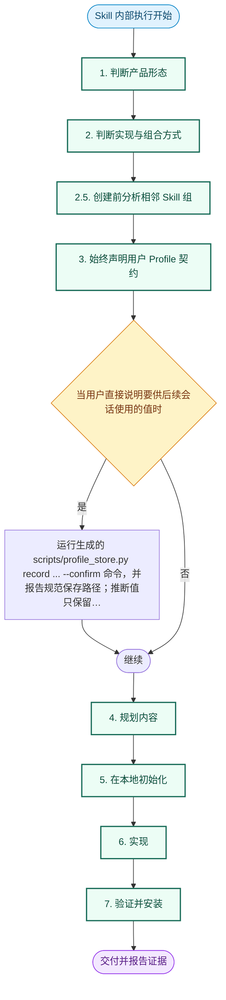
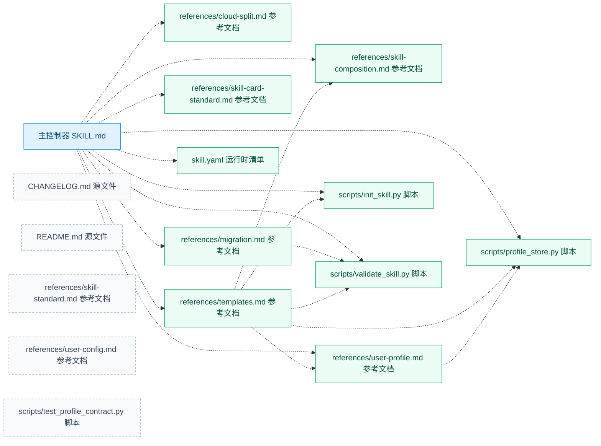

# lov-skill-creator · Skill 信任审阅

> 来源：`SKILL.md` · 版本：`4.3.0` · 模型：`lovstudio/skill-logic/v1`

## 信任覆盖

- 激活示例：2；非触发示例：2。
- 运行步骤：8；显式条件规则：1。
- 已链接资源：10；缺失资源：0；引用展开深度：2。
- Kit 模块：0；命名管线：0。
- 有能力依据的步骤：6；有验收规则的步骤：3；真实案例产物：0。

## 内部运行流程

## 资源与依赖关系

## 可追溯逻辑

| 步骤 | 摘要 | 来源 |
| --- | --- | --- |
| 1. 判断产品形态 | 提问前先使用当前请求、记忆、代码库和已有示例判断。 | SKILL.md:82-99 |
| 2. 判断实现与组合方式 | 自动选择，并简要说明结果。 | SKILL.md:100-115 |
| 2.5. 创建前分析相邻 Skill 组 | 生成骨架前，检查本地 Skill 源目录和已安装 Skill。 | SKILL.md:116-139 |
| 3. 始终声明用户 Profile 契约 | 每个新 Skill 都要在 skill.yaml 中声明 user-profile/v1。 | SKILL.md:140-167 |
| 4. 规划内容 | 确定性操作放入 scripts/，实现为独立的 argparse 命令行工具。 | SKILL.md:168-184 |
| 5. 在本地初始化 | 单一 Skill。 | SKILL.md:185-234 |
| 6. 实现 | 把源文件写成面向 Agent 的指令，而不是当前对话的笔记。 | SKILL.md:235-256 |
| 7. 验证并安装 | python3 scripts/validate_skill.py . | SKILL.md:257-281 |

### 条件分支

| 条件 | 动作 | 来源 |
| --- | --- | --- |
| 当用户直接说明要供后续会话使用的值时 | 运行生成的 scripts/profile_store.py record ... --confirm 命令，并报告规范保存路径；推断值只保留在当前请求上下文。 | SKILL.md:160-163 |

### 外部适用边界

> 这部分属于宿主路由，不进入上方 Skill 内部运行图。
- ✅ 用户要“创建 skill”“封装成 skill”“生成 Skill Kit”或优化 Skill 生成机制。 (`SKILL.md:31`)
- ✅ 用户要求创建、生成骨架、验证或在本地安装 Agent Skill。 (`SKILL.md:32`)
- ⛔ 用户只是在调用现有 Skill 完成业务任务。 (`SKILL.md:36`)
- ⛔ 用户要发布远程仓库、上架目录、生成平台发行包或上传 Skill；交给 lov-skill-publisher。 (`SKILL.md:37`)

## 诊断

- `info` · `unlinked_packaged_files` · 以下打包文件未被 SKILL.md 或已链接文档引用：references/skill-standard.md, references/user-config.md, scripts/test_profile_contract.py

> 说明：报告区分源码声明、能力依据、验收规则和真实效果。静态完整度不能替代运行案例与结果回读。
